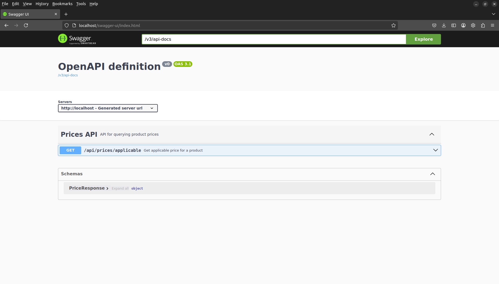
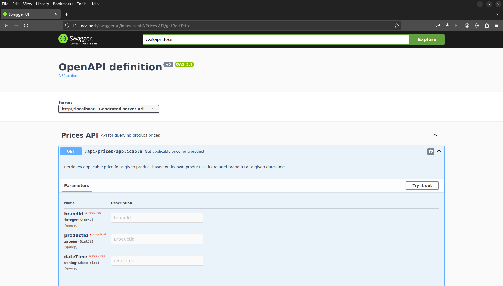
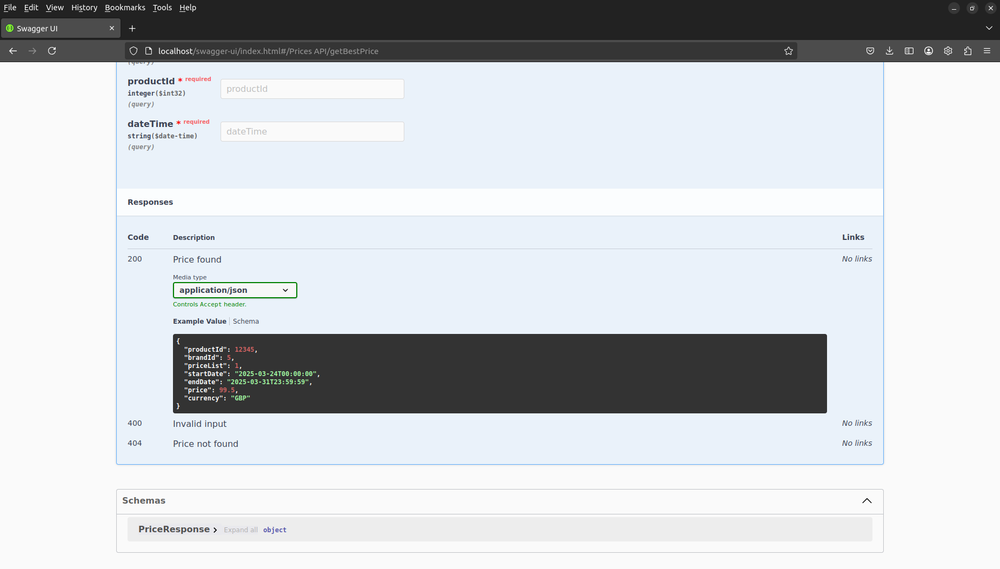
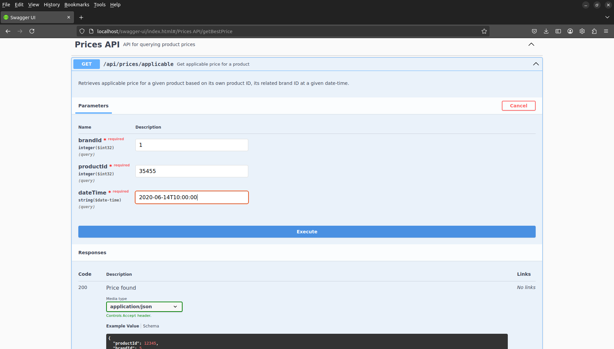
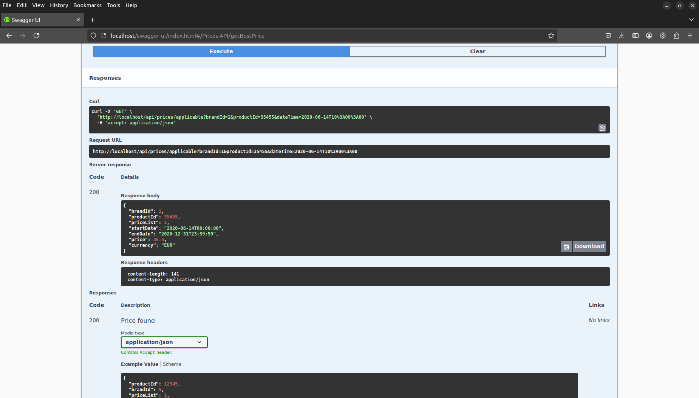

<a id="api-rest-para-consultar-precios-aplicables"></a>

# API REST PARA CONSULTAR PRECIOS APLICABLES


<!-- TOC -->

- [API REST PARA CONSULTAR PRECIOS APLICABLES](#api-rest-para-consultar-precios-aplicables)
    - [DESCRIPCION](#descripcion)
    - [PLAN](#plan)
        - [HITOS](#hitos)
    - [CODIFICACIÓN](#codificacion)
        - [INSTALACION Y ejecución](#instalacion-y-ejecucion)
            - [Abrir una terminal en el directorio de trabajo](#abrir-una-terminal-en-el-directorio-de-trabajo)
            - [Clonar el proyecto](#clonar-el-proyecto)
            - [Ejecutar la aplicación con Docker](#ejecutar-la-aplicacion-con-docker)
            - [Interactuar con la aplicación](#interactuar-con-la-aplicacion)
        - [ARQUITECTURA](#arquitectura)
            - [Estructura de directorios](#estructura-de-directorios)
            - [Contenido de directorios](#contenido-de-directorios)
        - [DESAROLLO](#desarollo)
        - [DEPENDENCIAS](#dependencias)
            - [Lombok v1.18.36](#lombok)
            - [Spring Reactive Web v3.4.4](#spring-reactive-web)
            - [Validation v3.4.4](#validation)
            - [Spring Data R2DBC v3.4.4](#spring-data-r2dbc)
            - [H2 Database v2.2.224](#h2-database)
            - [SpringDoc OpenAPI Starter WebFlux API v2.8.6](#springdoc-openapi-starter-webflux-api)
            - [SpringDoc OpenAPI Starter WebFlux UI v2.8.6](#springdoc-openapi-starter-webflux-ui)
    - [CONSTRUCCIÓN](#construccion)
        - [Crear un jar](#crear-un-jar)
        - [Crear una imagen de Docker:](#crear-una-imagen-de-docker)
    - [PRUEBAS](#pruebas)
        - [Ejecución de tests unitarios](#ejecucion-de-tests-unitarios)
        - [Ejecución de tests de integración](#ejecucion-de-tests-de-integracion)
        - [ejecución de tests aceptación](#ejecucion-de-tests-aceptacion)
    - [PUBLICACIÓN](#publicacion)
    - [DESPLIEGUE](#despliegue)
        - [Despliegue local con Docker](#despliegue-local-con-docker)
        - [Despliegue local con IDE](#despliegue-local-con-ide)
        - [Despliegue local con Maven y plugin de Spring Boot](#despliegue-local-con-maven-y-plugin-de-spring-boot)
        - [Despliegue local con Java](#despliegue-local-con-java)
    - [OPERACIONES](#operaciones)
    - [MONITORIZACIÓN](#monitorizacion)
    - [SIGUIENTES PASOS](#siguientes-pasos)
    - [ENLACES](#enlaces)

<!-- /TOC -->


<a id="descripcion"></a>

## DESCRIPCION 

Este repositorio aloja el código de mi la solución que he desarrollado para satisfacer los requisitos de una prueba técnica resumida en la siguiente historia de usuario:

> Historia de usuario 1:
>
> Como usuario de una API REST, quiero poder utilizar un punto de acceso para realizar consultas sobre una base de datos de precios para encontrar el precio aplicable al producto perteneciente a una marca en una fecha determinada.


<a id="plan"></a>

## PLAN

El objetivo de esta solución es producir un MVP para entregar una solución temprana que, aún siendo incompleta, trata de satisfacer la practica mayoría de los requisitos funcionales permitiendo además recoger la mayor  información sobre el dominio del cliente y sus expectativas en el producto tras la primera entrega. 

Este planteamiento permite dar una respuesta ágil a sus necesidades y planificar/priorizar tanto requisitos funcionales como técnicos para futuras iteraciones.

<a id="hitos"></a>

### HITOS

- [x] Implementar un servicio REST utilizando el framework Spring Boot.
- [x] Utilizar una base de datos en memoria del tipo H2.
- [x] Utilizar Apache Maven para gestionar distintas fases del desarrollo.
- [x] Aplicar una arquitectura concreta y consistente, que explique por sí sola la responsabilidad de los componentes.
- [x] Aplicar la metodología TDD para acometer el desarrollo de la solución
- [x] Implementar validación en los datos de entrada para mejorar la fiabilidad.
- [x] Diseñar un modelo de respuesta de errores consistente para aumentar la interoperabilidad.
- [x] Detallar las herramientas y versiones usadas.
- [x] Utilizar Spring WebFlux y Spring Data R2DBC para proporcionar el mejor rendimiento posible.

<a id="codificacion"></a>

## CODIFICACIÓN

Para implementar la solución he utilizado Spring Boot v3.4.4, para cumplir con los requisitos técnicos, y Java 17.

<a id="instalacion-y-ejecucion"></a>

### INSTALACION Y EJECUCIÓN

Para instalar y ejecutar el proyecto es necesario que el sistema tenga previamente instalados como mínimo Docker y Git en sus versiones mas recientes; será también requisito tener instalada la versión mas reciente de Java 17 en caso de realizar colaboraciones al proyecto.

Los pasos detallados a continuación son los necesarios en una maquína ejecutando Ubuntu 22. Aunque no se ha probado, el proceso puede ser muy similar en Windows/Mac.

1. Abrir una terminal en el directorio de trabajo

2. Clonar el proyecto

3. Ejecutar la aplicación con Docker

4. Interactuar con la aplicación

<a id="abrir-una-terminal-en-el-directorio-de-trabajo"></a>

#### Abrir una terminal en el directorio de trabajo

```
:~/workspace$ 
```

<a id="clonar-el-proyecto"></a>

#### Clonar el proyecto

```
:~/workspace$ git clone https://github.com/racavi/tech-test.git
```

<a id="ejecutar-la-aplicacion-con-docker"></a>

#### Ejecutar la aplicación con Docker

```
:~/workspace$ cd tech-test
:~/workspace/tech-test$ docker compose up 
```

<a id="interactuar-con-la-aplicacion"></a>

#### Interactuar con la aplicación

Visitar con un navegador web la siguiente URL: [http://localhost/swagger-ui/index.html](http://localhost/swagger-ui/index.html) y seguir las instrucciones detalladas en la sección ["ejecución de tests aceptacion"](#ejecución-de-tests-aceptacion)

<a id="arquitectura"></a>

### ARQUITECTURA

La disposición del proyecto sigue la estructura estándar de directorios de Maven. 

Las clases se agrupan en una estructura de paquetes raíz siguiendo las recomendaciones marcadas por Clean Architecture, 

Se aplica una separación de capas basada en Domain Driven Design (DDD) marcando contextos delimitados que reducen el acoplamiento entre las capas de la aplicación facilitando así la comprensión del modelo.

También se han aplicado los principios S.O.L.I.D. para proporcionar flexibilidad al diseño y facilitar el mantenimiento de la aplicación.

<a id="estructura-de-directorios"></a>

#### Estructura de directorios

```
.
├── docker-compose.yml
├── LICENSE
├── README.md
├── docs
│   └── ...
└── tech-test
    ├── src
    │   ├── main
    │   │   ├── java
    │   │   │   └── com
    │   │   │       └── rafacalvo
    │   │   │           └── prices
    │   │   │               ├── application
    │   │   │               ├── domain
    │   │   │               ├── infrastructure
    │   │   │               ├── presentation
    │   │   │               └── PricesApplication.java
    │   │   └── resources
    │   │       ├── application.properties
    │   │       ├── data.sql
    │   │       └── schema.sql
    │   └── test
    │       └── java
    │           └── com
    │               └── rafacalvo
    │                   └── prices
    │                       ├── application
    │                       ├── infrastructure
    │                       ├── presentation
    │                       └── PricesApplicationTests.java
```


<a id="contenido-de-directorios"></a>

#### Contenido de directorios

`docker-compose.yml`: Fichero con la configuración necesaria para ejecutar la aplicación con Docker Compose.

`LICENSE`: Archivo que contiene el texto legal de la licencia aplicable a este proyecto.

`README.md`: Este fichero. 

`docs/`: Directorio auxiliar para albergar documentación adicional a la aquí presentada. También puede contener recursos como imágenes para enriquecer la documentación.

`tech-test/src/main/java/com/rafacalvo/prices/`

Directorio creado por defecto por Spring Initializr basado en los parámetros de configuración utilizados para generar el esqueleto de la aplicación con Maven.

`tech-test/src/main/java/com/rafacalvo/prices/application`

Contiene las clases asociadas a la capa de aplicación en una aplicación basada en DDD. Sus clases se relacionaran directamente con aquellas de la capa `domain` e indirectamente con las de la capa `infrastructure` mediante la inyección de dependencias (DI) proporcionada por Spring.

`tech-test/src/main/java/com/rafacalvo/prices/domain`

Se encuentran clases puramente asociadas a la capa de dominio. En nuestro caso una unica entidad de dominio `Price` y un subpaquete `querying` influido por CQRS y Screaming Architecture donde reside el repositorio `PriceRepository` y una excepción de negocio `PriceNotFoundException`.

`tech-test/src/main/java/com/rafacalvo/prices/infrastructure/persistence`

En este directorio nos encontramos una implementación de la entidad de dominio `PriceEntity`, un sencillo adaptador que implementa el contrato definido por el repositorio el dominino `PriceRepositoryAdapter` y otro repositorio específico de Spring Data R2DBC.

`tech-test/src/main/java/com/rafacalvo/prices/presentation`

Este directorio alberga clases propias de la capa de presentación en DDD como: el controlador REST, anotaciones para construir la definición de la API y controlar la validación de los parámetros de entrada, un manejador de excepciones que utiliza `@ControllerAdvice` y una clase auxiliar para albergar ejemplos de respuesta de la API.

`tech-test/src/main/resources`

Contiene el típico fichero de propiedades de una aplicación Spring Boot `application.properties` y los ficheros que utilizara Spring Data R2DBC (`schema.sql` y `data.sql`) para crear el esquema de la BBDD y poblar la tabla `PRICES` tanto para el contexto de aplicación como el para los tests de integración.

`tech-test/src/test/java/com/rafacalvo/prices/`

Alberga el test de humo que proporciona Spring Initializr en todo esqueleto de Spring Boot para validar la correcta configuración del contexto.

`tech-test/src/test/java/com/rafacalvo/prices/application`

Agrupa los tests unitarios y de integración para las clases de la capa de aplicación. En este caso los test para `PriceQueryingService` 

`tech-test/src/test/java/com/rafacalvo/prices/infrastructure`

Este directorio contiene tests unitarios y tests de integración para las clases de la capa de infraestructura.

**IMPORTANTE:** `PriceR2DBCRepositoryIT` implementa la definición de los 5 tests incluidos en la prueba técnica.

`tech-test/src/test/java/com/rafacalvo/prices/presentation`

Este último directorio esta concebido para albergar los tests unitarios y de integración de las clases propias de la capa de presentación. Actualmente ocupado por un test unitario para probar la implementación de la validación.

<a id="desarollo"></a>

### DESAROLLO

Para el desarrollo de la aplicación he aplicado Test-driven development (TDD) siguiendo el patrón `Given -> When -> Then` establecido por Behavior-driven development (BDD) para facilitar la lectura y comprensión de los tests al usuario y/o equipo de test.

<a id="dependencias"></a>

### DEPENDENCIAS

<a id="lombok"></a>

#### Lombok v1.18.36

Biblioteca de anotaciones de Java que ayuda a reducir el código repetitivo.

<a id="spring-reactive-web"></a>

#### Spring Reactive Web v3.4.4

Crea aplicaciónes web reactivas con Spring WebFlux y Netty.

<a id="validation"></a>

#### Validation v3.4.4

Validación de Bean con el validador de Hibernate.

<a id="spring-data-r2dbc"></a>

#### Spring Data R2DBC v3.4.4

Proporciona conectividad de base de datos relacional reactiva para conservar datos en almacenes SQL mediante Spring Data en aplicaciones reactivas.

<a id="h2-database"></a>

#### H2 Database v2.2.224

Proporciona una base de datos rápida en memoria compatible con la API JDBC y el acceso R2DBC, con un tamaño compacto (2 MB). Admite modos integrado y de servidor, así como una aplicación de consola basada en navegador.

<a id="springdoc-openapi-starter-webflux-api"></a>

#### SpringDoc OpenAPI Starter WebFlux API v2.8.6

Genera automáticamente documentación de OpenAPI 3 en formato JSON/YAML y HTML. Esta documentación puede completarse con comentarios mediante las anotaciones de swagger-api.

<a id="springdoc-openapi-starter-webflux-ui"></a>

#### SpringDoc OpenAPI Starter WebFlux UI v2.8.6

Crea un endpoint SwaggerUI para interactuar con el archivo de especificación de API OpenAPI 3 generado por el anterior modulo.

<a id="construccion"></a>

## CONSTRUCCIÓN

El código de la aplicación debe ser compilado para crear un ejecutable, conocido como fat jar en la jerga de Spring Boot, y poder ser posteriormente ejecutado con Java con un JRE de Java 17.

Aparte también es deseable construir una imagen de Docker si se desea crear una distribución portable de la aplicación fácil de desplegar en distintos entornos.

Es por ello que se muestra a continuación las dos formas de construir la aplicación (creando un jar o creando una imagen de Docker)

<a id="crear-un-jar"></a>

### Crear un jar

```
tech-test$: ./mvnw clean package 
```

<a id="crear-una-imagen-de-docker"></a>

### Crear una imagen de Docker:

```
tech-test$: ./mvnw spring-boot:build-image
```

<a id="pruebas"></a>

## PRUEBAS

La aplicación se acompaña de una serie de tests unitarios y de integración. Estos tests sirven para validar el contrato de las clases (unitarios) y las interacciones entre ellos (integración).

Deben ejecutarse cada vez que se introducen cambios en el código para permitir la detección temprana de regresiones y/o bugs con dichos cambios antes de integrar estos cambios en la rama principal del proyecto.

Las clases que implementan tests unitarios terminan con el sufijo `Test` y las clases que implementan tests de integración terminan con el sufijo `IT`. Esta convención nos permite ejecutar los tests unitarios de forma aislada, ya que su ejecución es mas rápida que la de los tests unitarios. De esta forma si se detecta un error en un test unitario deberá ser corregido antes de ejecutar la bateria de tests de integración.

<a id="ejecucion-de-tests-unitarios"></a>

### Ejecución de tests unitarios

```
tech-test$: ./mvnw test
```


<a id="ejecucion-de-tests-de-integracion"></a>

### Ejecución de tests de integración

```
tech-test$: ./mvnw verify
```


**NOTA:** La ejecución de tests de integración conlleva la previa ejecución de los tests unitarios.


<a id="ejecucion-de-tests-aceptacion"></a>

### Ejecución de tests aceptación

Para poder ejecutar tests de aceptación es requisito haber desplegado previamente la aplicación (instrucciones en la sección [DESPLIEGUE](#despliegue)).

Una vez desplegada la aplicación podemos a probar el endpoint REST que proporciona la funcionalidad de búsqueda de precios con herramientas como `curl`, `HTTPie`, `Postman` o `Swagger UI`.

A continuación se muestra como ejecutar los tests de aceptación en una instancia desplegada en local con Docker utilizando Swagger UI, una herramienta diseñada para interactuar con APIs REST a través de una interfaz web. Para ello procederemos de la siguiente forma:

1. Abrimos un navegador web (en este caso FireFox)
2. pegamos en la barra de navegacion la URL: [http://localhost/swagger-ui.html](http://localhost/swagger-ui.html) 
3. pulsamos Intro. 

Acto seguido, el navegador nos mostrara una interfaz de Swagger UI que nos permitirá lanzar peticiones al único endpoint de la API (Prices API).

**Vista por defecto de Swagger UI**



Dicho endpoint aparece en un desplegable nombrado: `GET /api/prices/applicable`. Al hacer clic en el desplegable Swagger UI ofrece mas información del endpoint como los parámetros que acepta y los tipos de respuestas que proporciona.

**parámetros de entrada**



**Tipos de respuesta**




Swagger UI también permite interactuar con la API. Con esta herramienta podremos ejecutar los tests de aceptación. Para ello debemos:

1. Pulsar el boton llamado 'Try it out'.
2. Introducir los parámetros de entrada.
3. Pulsar el boton 'Execute'

**Probando la API**



Tras un breve instante la interfaz de Swagger UI mostrara la respuesta de la petición que acabamos de lanzar

**Respuesta del endpoint**



- **OpenAPI JSON**: [http://localhost/v3/api-docs](http://localhost/v3/api-docs)


<a id="publicacion"></a>

## PUBLICACIÓN

N/A

<a id="despliegue"></a>

## DESPLIEGUE

Este proyecto puede desplegarse en local de cuatro formas. Siendo la forma mas sencilla mediante el empleo de Docker y la mas compleja utilizando Maven.

<a id="despliegue-local-con-docker"></a>

### Despliegue local con Docker

```
tech-test$: docker compose up
```

<a id="despliegue-local-con-ide"></a>

### Despliegue local con IDE

Cualquier Entorno de Desarrollo Integrado (IDE en incles) con soporte para Java y Maven como VS Code, IntelliJ IDEA, Eclipse, NetBeans, etc... permitirá la ejecución de una aplicación tipo Spring Boot. Ver documentación oficial para un IDE concreto.

<a id="despliegue-local-con-maven-y-plugin-de-spring-boot"></a>

### Despliegue local con Maven y plugin de Spring Boot

El plugin de Spring Boot para Maven proporciona una nueva meta (goal) a este ultimo que al emplearla construye el proyecto y lo ejecuta automáticamente.

```
tech-test$: ./mvnw spring-boot:run
```

<a id="despliegue-local-con-java"></a>

### Despliegue local con Java

Para poder ejecutar en local la aplicación solamente con Maven, es necesario haber compilado y empaquetado la aplicación previamente en un jar como se detalla en el apartado ["Crear un jar"](#crear-un-jar). En caso afirmativo se procedería a ejecutar el siguiente comando:

```
tech-test$: java -jar target/prices-0.0.1-SNAPSHOT.jar
```

<a id="operaciones"></a>

## OPERACIONES

N/A

<a id="monitorizacion"></a>

## MONITORIZACIÓN

N/A

<a id="siguientes-pasos"></a>

## SIGUIENTES PASOS

Discutir la solución con Product Owner y demás interesados para priorizar  temas como:

- Revisar el contrato de la API para buscar posibles mejoras.
- Efectuar pruebas de carga aumentando el numero de registros del juego de datos de test.
- Revisar arquitectura y disposición del código y refactorizar acordemente.
- Utilizar herramientas como Dependabot (GitHub) para Mantener las versiones de las dependencias actualizadas.
- Emplear herramientas como Snyk (GitHub) para detectar problemas de seguridad en las dependencias del proyecto.
- Disponer linters en los IDE para detectar antipatrones, código muerto y demás 'code smells'.
- Evaluar la posibilidad de utilizar una cache si se utiliza otro SGBD para mejorar el rendimiento.
- Integrar herramientas como Spring Actuator auditar el rendimiento del sistema.
- Implementar mecanismos de Autenticación/Autorización para proteger la aplicación de abusos.
- Crear pipeline CI/CD para permitir despliegues automáticos de código estable.

...

Pero sin una reunión, esta lista podría alargarse ad infinitum...

<a id="enlaces"></a>

## ENLACES

- [Minimum Viable Product (MVP) | Agile Alliance](https://www.agilealliance.org/glossary/mvp/)
- [Introduction to the Standard Directory Layout | Maven](https://maven.apache.org/guides/introduction/introduction-to-the-standard-directory-layout.html)
- [The Clean Architecture | The Clean Code Blog](https://blog.cleancoder.com/uncle-bob/2012/08/13/the-clean-architecture.html)
- [ Anatomy of a Spring Boot App with Clean Architecture by Steve Pember @ Spring I/O 2023 | Youtube](https://www.youtube.com/watch?v=mbNzUkNjrnA)
- [Domain Driven Design Reference Guide (PDF)](https://www.domainlanguage.com/ddd/reference/)
- [CQRS | Wikipedia](https://en.wikipedia.org/wiki/Command_Query_Responsibility_Segregation)
- [Screaming Architecture | The Clean Code Blog](https://blog.cleancoder.com/uncle-bob/2011/09/30/Screaming-Architecture.html)
- [Spring Data R2DBC | spring.io](https://spring.io/projects/spring-data-r2dbc)
- [Spring Initializr](https://start.spring.io/index.html)
